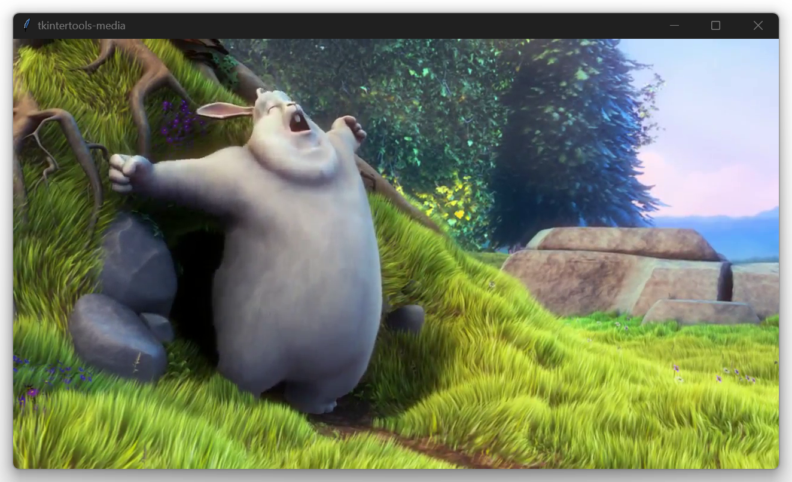

<h1 align="center">tkintertools-media</h1>

<p align="center">extension package for tkintertools to media</p>

<p align="center">
<a href="https://github.com/Xiaokang2022/tkintertools-media/watchers"></a>
<a href="https://github.com/Xiaokang2022/tkintertools-media/forks"></a>
<a href="https://github.com/Xiaokang2022/tkintertools-media/stargazers"></a>
<a href="https://github.com/Xiaokang2022/tkintertools-media/issues"></a>
<a href="https://github.com/Xiaokang2022/tkintertools-media/pulls"></a>
<a href="https://github.com/Xiaokang2022/tkintertools-media/discussions"></a>
</p>

<p align="center">
<a href="https://github.com/Xiaokang2022/tkintertools-media/pulse"></a>
</p>

<p align="center">
    <a href="https://star-history.com/#Xiaokang2022/tkintertools-media&Date">
        <picture>
            <source media="(prefers-color-scheme: dark)" srcset="https://api.star-history.com/svg?repos=Xiaokang2022/tkintertools-media&type=Date&theme=dark" />
            <source media="(prefers-color-scheme: light)" srcset="https://api.star-history.com/svg?repos=Xiaokang2022/tkintertools-media&type=Date" />
            
        </picture>
    </a>
</p>

📦 Installation / 安装
----------------------

```
pip install tkintertools-media
```

> [!IMPORTANT]  
> `tkintertools`: https://github.com/Xiaokang2022/tkintertools

### 👀 Preview / 预览

The sample video is downloaded from: http://www.sample-videos.com/



<details><summary>Code</summary>

```python
import tkintertools as tkt
import tkintertools.media as media

root = tkt.Tk(title="tkintertools-media")
cv = media.VideoCanvas(root, keep_ratio="min", free_anchor=True, control=True, max_fps=60)
cv.place(width=1280, height=720, x=640, y=360, anchor="center")
cv.play("your_video_file.mp4")
root.mainloop()
```

</details>
